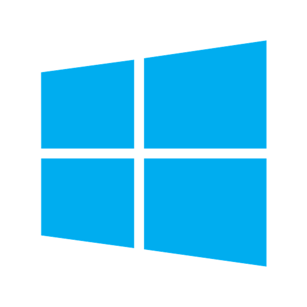
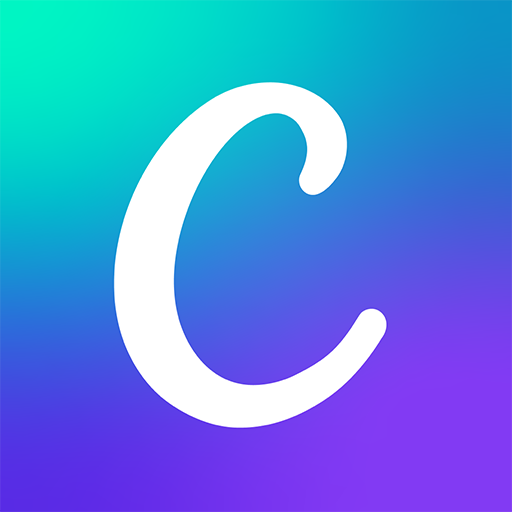

 ### ✉️ Contacto: **tatianalourdesgaleano@gmail.com** 
  
<table>
  <tr>
    <td>
      <h3> 👩‍💻 Lenguajes y herramientas: 
      
      
      
      
      
      
      
      
      
      
      
      
      
      </td>
    <td>
<h3> 📊 Lenguajes más usados

 </td>
  </tr>
</table>

<picture>
    <source media="(prefers-color-scheme: dark)" srcset="https://raw.githubusercontent.com/galeanotatiana/galeanotatiana/output/pacman-contribution-graph-dark.svg">
    <source media="(prefers-color-scheme: light)" srcset="https://raw.githubusercontent.com/galeanotatiana/galeanotatiana/output/pacman-contribution-graph.svg">
    
</picture>
